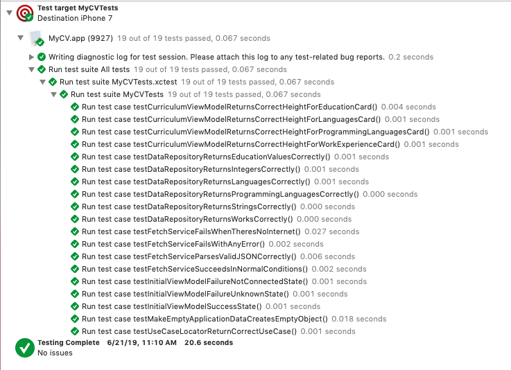

# My CV

This repository is used to show my CV in the form of a native iOS application.

## Summary

This application uses the MVVM design pattern while using Clean Architecture principles. The app is divided into 3 main sections **Core**, **ViewModels** and **View**.

### Core

This section contains all classes and protocols that handle used all over the app. It is itself divided into 3 sections: **Entities**, **Services** and **UseCases**. The first one represents the data model used to handle the CV. The second one is used to host the network layer and tries to use protocols to allow mocking of this layer. Finally, the third one contains business rules logic, this section contains protocols and their implementation to enforce the Single Responsibility Principle. Each case is accessed through a Service Locator class that provides centralized access to resolve use cases.

### ViewModels

The classes in this section handle those properties required by views without containing itself any view code. ViewModels in this section rely on use cases to get data and format it to present it to the view.

### View

This section contains all Storyboards, View Controllers and custom `UIView` subclasses.

## Screenshots

## Test

The approach to testing consists in mocking all services used so that tests are fast, isolated and repeatable without the delays of network calls.

